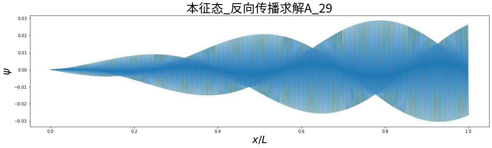
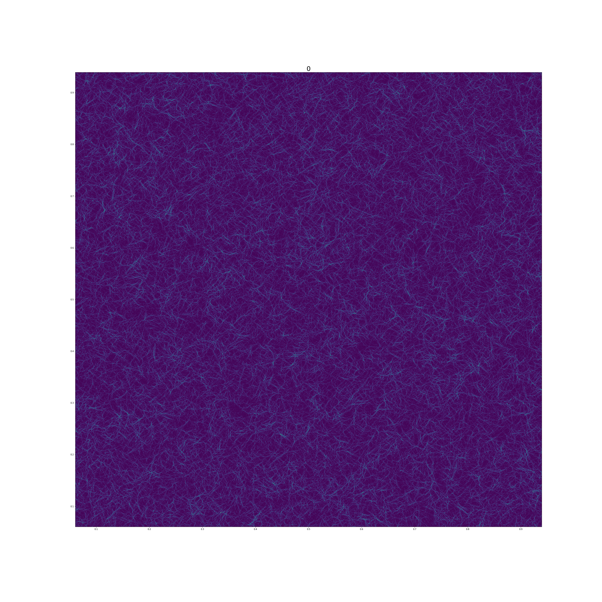
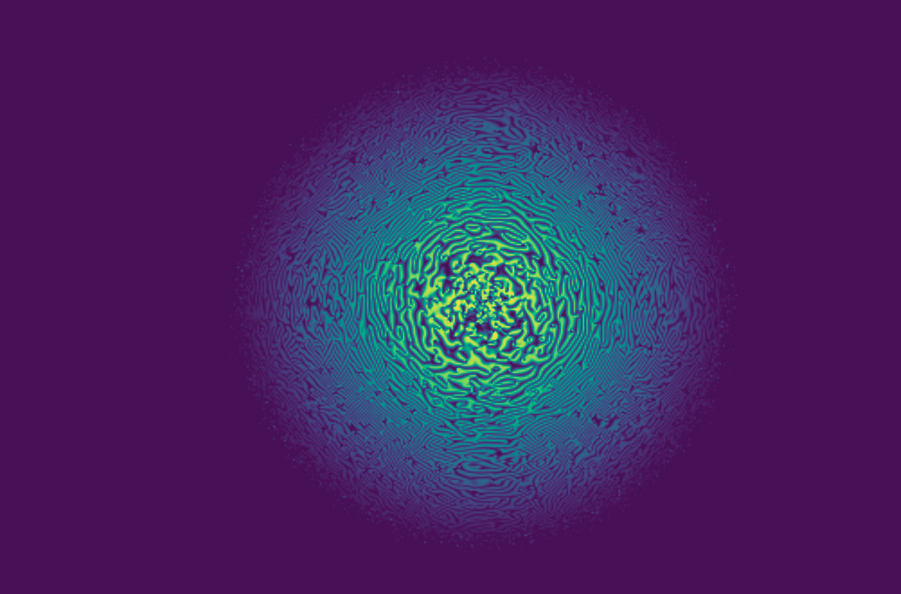

# 用神经网络求解定态薛定谔方程
## 前言
这里展示了我用构建神经网络的方法求解量子力学里的定态薛定谔方程的结果、原理、源码。

解得的结果让我感觉到有些惊讶。这些是薛定谔方程的解吗？希望有兴趣的朋友能共同研究。

你们还可以参看我在bilibili的视频。
[用神经网络求解量子力学里的定态薛定谔方程（图形化表示）](https://www.bilibili.com/video/BV1hr4y1z73X)

## 展示
一维薛定态谔方程势能分布全为0的一个解

二维薛定态谔方程势能分布全为0的一个解

二维薛定态谔方程强中心势能的一个解

## 原理

一维薛定态谔方程：

$$\frac{-ħ^2} {2m}\frac{d^2 \psi}{dx^2}+V(x)\psi  = E\psi $$

二维薛定态谔方程：

$$\frac{-ħ^2} {2m}(\frac{\partial^2 \psi}{\partial y^2}+\frac{\partial^2 \psi}{\partial x^2})+V(x,y)\psi  = E\psi $$

三维薛定态谔方程：

$$\frac{-ħ^2} {2m}(\frac{\partial^2 \psi}{\partial x^2}+\frac{\partial^2 \psi}{\partial y^2}+\frac{\partial^2 \psi}{\partial z^2})+V(x,y,z)\psi  = E\psi $$

### 第一步 去量纲

$$X=\frac x L$$
$$Y=\frac y L$$
$$Z=\frac z L$$
$$ħ=1$$

$$-\frac{1} {2}\frac{d^2 \psi}{dX^2}+mL^2V(X)\psi  = mL^2E\psi $$
$$-\frac{1} {2}(\frac{\partial^2 \psi}{\partial Y^2}+\frac{\partial^2 \psi}{\partial X^2})+mL^2V(X,Y)\psi  = mL^2E\psi $$
$$-\frac{1} {2}(\frac{\partial^2 \psi}{\partial X^2}+\frac{\partial^2 \psi}{\partial Y^2}+\frac{\partial^2 \psi}{\partial Z^2})+mL^2V(X,Y,Z)\psi  = mL^2E\psi $$

### 第二步 微分方程转差分方程
原理：

$$\frac{d^2 f}{dx^2}_{x=j\Delta x}  = \frac{f_{j+1}+2f_{j}+f_{j-1}}{\Delta x^2}$$
$$\lim_{\Delta x \to 0}$$

一维:

$$-\frac{\psi_{i+1}+2\psi_{i}+\psi_{i-1}}{2\Delta X^2}+mL^2V_i\psi_i= mL^2E\psi_i $$

二维： 

$$-\frac 1 2(\frac{\psi_{j(i+1)}+2\psi_{ji}+\psi_{j(i-1)}}{\Delta X^2}+\frac{\psi_{(j+1)i}+2\psi_{ji}+\psi_{(j-1)i}}{\Delta Y^2})+mL^2V_{ji}\psi_{ji}= mL^2E\psi_{ji} $$

三维：

$$-\frac 1 2(\frac{\psi_{kj(i+1)}+2\psi_{kji}+\psi_{kj(i-1)}}{\Delta X^2}+\frac{\psi_{k(j+1)i}+2\psi_{kji}+\psi_{k(j-1)i}}{\Delta Y^2}+\frac{\psi_{(k+1)ji}+2\psi_{kji}+\psi_{(k-1)ji}}{\Delta Z^2})+mL^2V_{kji}\psi_{kji}= mL^2E\psi_{kji} $$

#### 进一步转化
一维: 

 $$-\frac{\psi_{i+1}}{2\Delta X^2}+({\frac 1 {\Delta X^2}+ mL^2V_{i}})\psi_{i}+\frac{\psi_{i-1}}{-2\Delta X^2}= mL^2E\psi_{i} $$  
 二维：
 
$$\frac{\psi_{j(i+1)}}{-2\Delta X^2}+\frac{\psi_{(j+1)i}}{-2\Delta Y^2}+({\frac 1 {\Delta X^2}+ \frac 1 {\Delta Y^2}+mL^2V_{ji}})\psi_{ji}+\frac{\psi_{j(i-1)}}{-2\Delta X^2}+\frac{\psi_{(j-1)i}}{-2\Delta Y^2}= mL^2E\psi_{ji} $$  
三维：

 $$\frac{\psi_{kj(i+1)}}{-2\Delta X^2}+\frac{\psi_{k(j+1)i}}{-2\Delta Y^2}+\frac{\psi_{(k+1)ji}}{-2\Delta Z^2}+({\frac 1 {\Delta X^2}+ \frac 1 {\Delta Y^2}+\frac 1 {\Delta Z^2}+mL^2V_{kji}})\psi_{kji}+\frac{\psi_{kj(i-1)}}{-2\Delta X^2}+\frac{\psi_{k(j-1)i}}{-2\Delta Y^2}+\frac{\psi_{(k-1)ji}}{-2\Delta Z^2}= mL^2E\psi_{kji} $$  

 ### 第三步 差分方程矩阵表示

 一维:
 
$$ \begin{bmatrix}-\frac{1}{2\Delta X^2} & {\frac 1 {\Delta X^2}+ mL^2V_{i}} &  \frac{1}{-2\Delta X^2} \\  \end{bmatrix}\begin{bmatrix} \psi_{i-1} \\ \psi_i \\  \psi_{i+1} \end{bmatrix}= mL^2 E  \psi_i $$

二维:

$$ \begin{bmatrix}\frac{1}{-2\Delta X^2} & \frac{1}{-2\Delta Y^2} &{\frac 1 {\Delta X^2}+\frac 1 {\Delta Y^2}+ mL^2V_{i}} &  \frac{1}{-2\Delta X^2} &  \frac{1}{-2\Delta Y^2}\\  \end{bmatrix}\begin{bmatrix} \psi_{j(i+1)} \\ \psi_{(j+1)i} \\  \psi_{ji} \\\psi_{j(i-1)}\\\psi_{(j-1)i}\end{bmatrix}= mL^2 E \psi_{ji} $$

三维:

$$ \begin{bmatrix}\frac{1}{-2\Delta X^2} & \frac{1}{-2\Delta Y^2} &\frac{1}{-2\Delta Z^2} &{\frac 1 {\Delta X^2}+ \frac 1 {\Delta Y^2}+\frac 1 {\Delta Z^2}+mL^2V_{i}} &  \frac{1}{-2\Delta X^2} &  \frac{1}{-2\Delta Y^2} &  \frac{1}{-2\Delta Z^2}\\  \end{bmatrix}\begin{bmatrix} \psi_{kj(i+1)} \\ \psi_{k(j+1)i} \\ \psi_{(k+1)ji} \\  \psi_{kji} \\\psi_{kj(i-1)}\\\psi_{k(j-1)i}\\\psi_{(k-1)ji}\end{bmatrix}= mL^2 E   \psi_{kji}$$

### 代码实现
这个方程目的是求解 $\psi$ 和E
基本思路是把$\psi$ 和E作为神经网络的参数。

但是在实现方式上，这里不再构建本征方程。
而直接用pytorch里面的embedding方从作为$\psi$ 的参数里引索对应的$\psi$。

具体实现参看上传的代码

[神经网络求解薛定谔方程_一维](神经网络求解薛定谔方程_一维.ipynb)

[神经网络求解薛定谔方程_二维](神经网络求解薛定谔方程_二维.ipynb)

[神经网络求解薛定谔方程_三维](神经网络求解薛定谔方程_三维.ipynb)

## 参考资料
[lukepolson_A](https://github.com/lukepolson/youtube_channel/blob/main/Python%20Metaphysics%20Series/vid3.ipynb)

[lukepolson_B](https://lukepolsonphysicsblog.wordpress.com/2020/10/29/example-post-3/)
